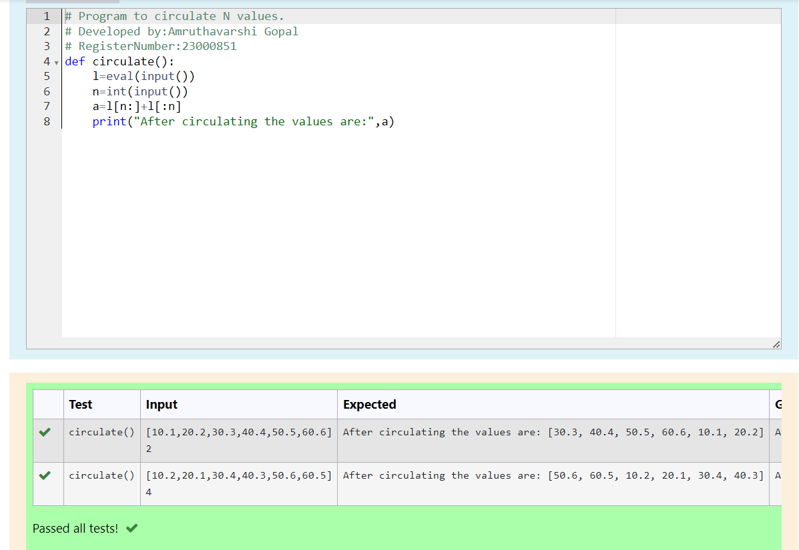

# Circulate-the-values-of-N-variables
## Aim:
To write a python program to circulate the n variables using function concept
## Equipment’s required:
PC
Anaconda - Python 3.7
## Algorithm: 
### Step 1: 
Define a function with a suitable name
### Step 2:
Get the input from the user for the values to put in a set
### Step 3: 
Get the value from the user for the number of rotation
### Step 4:
Using the slicing concept rotate the list and store the value in a variable
### Step 5:
print the respected value
### Step 6:
End the program

## Program:
```
# Program to circulate N values.
# Developed by:Amruthavarshini Gopal 
# RegisterNumber:23000851
def circulate():
    l=eval(input())
    n=int(input())
    a=l[n:]+l[:n]
    print("After circulating the values are:",a)
```

## Output:


## Result:
Thus the circulation of n variables are successfully executed
